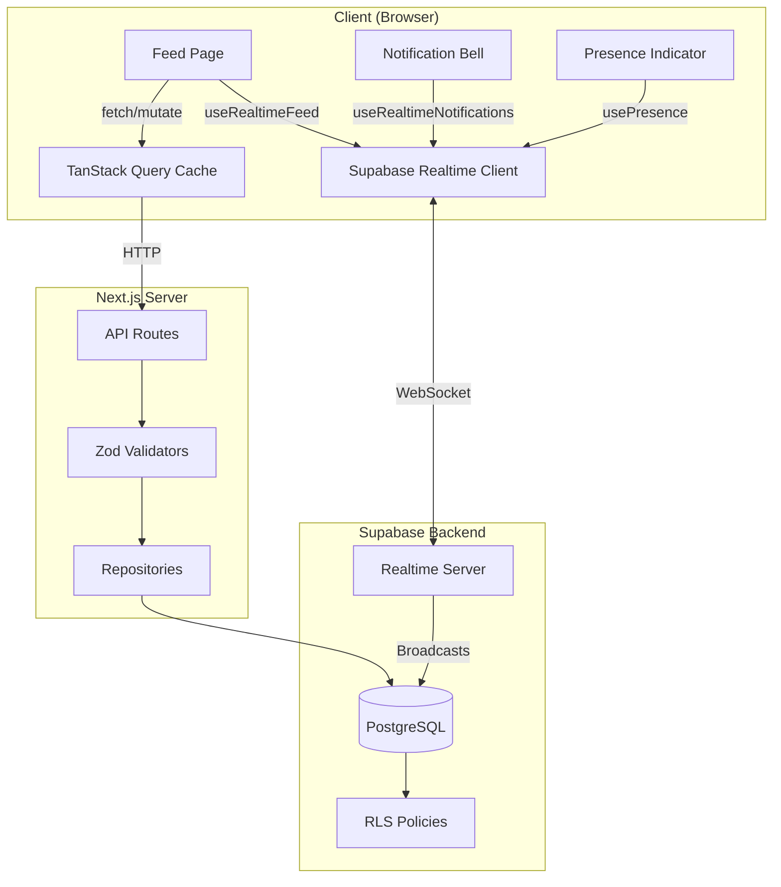
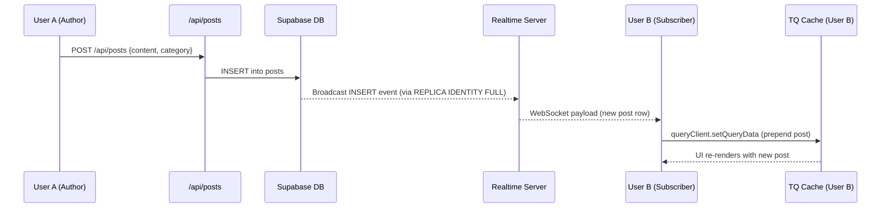

# Design Document: Realtime Feed & Notifications

## Overview

This design adds realtime capabilities to the M.A.G.E. Digital Guild Platform by layering Supabase Realtime subscriptions, a notifications system, admin moderation tools, and presence tracking on top of the existing feed infrastructure. The architecture preserves the current layered pattern (Repositories → Services → API Routes → Client) while introducing client-side realtime hooks that integrate with TanStack React Query for cache management and optimistic updates.

### Key Design Decisions

1. **Supabase Realtime over WebSocket server**: Leverages existing Supabase infrastructure — no additional server deployment needed. Realtime is enabled via `ALTER TABLE ... REPLICA IDENTITY FULL` and RLS policies control which rows are broadcast to which clients.

2. **TanStack Query as single source of truth**: All feed/notification state lives in the React Query cache. Realtime events update the cache directly via `queryClient.setQueryData`, avoiding duplicate state management.

3. **Repository pattern preserved**: New `NotificationRepository` and `ReportRepository` extend `BaseRepository` consistently with `PostRepository` and `InteractionRepository`.

4. **Cursor-based pagination**: Replaces offset-based pagination for the feed to work naturally with prepended realtime inserts (avoids item duplication on page boundaries).

5. **Channel strategy**: Three Supabase Realtime channels — `feed` (posts table changes), `notifications:{userId}` (per-user notification inserts), and `presence:guild` (shared presence tracking).

---

## Architecture

### High-Level System Diagram



### Data Flow: Realtime Post Insert



---

## Components and Interfaces

### Database Layer (New Tables & Migrations)

#### notifications table

```sql
CREATE TABLE notifications (
  id BIGINT GENERATED ALWAYS AS IDENTITY PRIMARY KEY,
  user_id UUID NOT NULL REFERENCES profiles(id) ON DELETE CASCADE,
  type TEXT NOT NULL CHECK (type IN ('comment', 'reaction', 'mention', 'post', 'moderation')),
  title TEXT NOT NULL,
  body TEXT NOT NULL,
  entity_type TEXT,
  entity_id TEXT,
  actor_id UUID REFERENCES profiles(id) ON DELETE SET NULL,
  is_read BOOLEAN NOT NULL DEFAULT FALSE,
  created_at TIMESTAMPTZ NOT NULL DEFAULT NOW()
);

CREATE INDEX idx_notifications_user_unread ON notifications(user_id, is_read, created_at DESC);
CREATE INDEX idx_notifications_user_created ON notifications(user_id, created_at DESC);

ALTER TABLE notifications REPLICA IDENTITY FULL;
```

#### reports table

```sql
CREATE TABLE reports (
  id BIGINT GENERATED ALWAYS AS IDENTITY PRIMARY KEY,
  post_id BIGINT NOT NULL REFERENCES posts(id) ON DELETE CASCADE,
  reporter_id UUID NOT NULL REFERENCES profiles(id) ON DELETE CASCADE,
  reason TEXT NOT NULL,
  status TEXT NOT NULL DEFAULT 'pending' CHECK (status IN ('pending', 'reviewed', 'dismissed')),
  reviewed_by UUID REFERENCES profiles(id) ON DELETE SET NULL,
  created_at TIMESTAMPTZ NOT NULL DEFAULT NOW(),
  reviewed_at TIMESTAMPTZ
);

CREATE INDEX idx_reports_status_created ON reports(status, created_at);
```

#### posts table modification

```sql
ALTER TABLE posts ADD COLUMN deleted_at TIMESTAMPTZ DEFAULT NULL;
```

#### Realtime enablement

```sql
ALTER TABLE posts REPLICA IDENTITY FULL;
ALTER TABLE comments REPLICA IDENTITY FULL;
ALTER TABLE reactions REPLICA IDENTITY FULL;
```

#### RLS Policies

```sql
-- notifications: users can only read their own
CREATE POLICY "Users read own notifications"
  ON notifications FOR SELECT
  USING (auth.uid() = user_id);

CREATE POLICY "Users update own notifications"
  ON notifications FOR UPDATE
  USING (auth.uid() = user_id);

CREATE POLICY "Service role inserts notifications"
  ON notifications FOR INSERT
  WITH CHECK (true);

-- posts: authenticated users see non-hidden, non-deleted posts (for realtime)
CREATE POLICY "Authenticated users read visible posts"
  ON posts FOR SELECT
  USING (is_hidden = false AND deleted_at IS NULL);

-- reports: authenticated users can insert
CREATE POLICY "Authenticated users create reports"
  ON reports FOR INSERT
  WITH CHECK (auth.uid() = reporter_id);

-- reports: admins can read all
CREATE POLICY "Admins read reports"
  ON reports FOR SELECT
  USING (EXISTS (
    SELECT 1 FROM profiles WHERE id = auth.uid() AND role = 'admin'
  ));
```

### Repository Layer

#### NotificationRepository

```typescript
// src/lib/repositories/notifications.ts
import { BaseRepository } from "./base";
import type { Notification } from "@/lib/types/database";

export interface NotificationFilters {
  userId: string;
  limit?: number;
  offset?: number;
  unreadOnly?: boolean;
}

export class NotificationRepository extends BaseRepository {
  async create(params: {
    userId: string;
    type: Notification["type"];
    title: string;
    body: string;
    entityType?: string;
    entityId?: string;
    actorId?: string;
  }): Promise<Notification> { /* ... */ }

  async findByUser(filters: NotificationFilters): Promise<Notification[]> { /* ... */ }

  async markAsRead(id: number, userId: string): Promise<void> { /* ... */ }

  async markAllAsRead(userId: string): Promise<void> { /* ... */ }

  async getUnreadCount(userId: string): Promise<number> { /* ... */ }
}
```

#### ReportRepository

```typescript
// src/lib/repositories/reports.ts
import { BaseRepository } from "./base";
import type { Report } from "@/lib/types/database";

export class ReportRepository extends BaseRepository {
  async create(params: {
    postId: number;
    reporterId: string;
    reason: string;
  }): Promise<Report> { /* ... */ }

  async findPending(): Promise<(Report & { posts: Post; profiles: Profile })[]> { /* ... */ }

  async review(id: number, reviewerId: string, status: "reviewed" | "dismissed"): Promise<void> { /* ... */ }
}
```

#### Extended PostRepository (soft-delete support)

```typescript
// Added to existing PostRepository
async softDelete(id: number, userId: string): Promise<void> {
  await this.db.from("posts")
    .update({ deleted_at: new Date().toISOString() })
    .eq("id", id);
  await this.logActivity(userId, "soft_delete", "moderation", String(id));
}

async unhide(id: number, userId: string): Promise<void> {
  await this.db.from("posts")
    .update({ is_hidden: false })
    .eq("id", id);
  await this.logActivity(userId, "unhide", "moderation", String(id));
}
```

### Service Layer

#### NotificationService

Wraps `NotificationRepository` with business logic — notably the "don't notify self" rule and notification creation as a side effect of interactions:

```typescript
// src/lib/services/notifications.ts
export class NotificationService {
  private repo = new NotificationRepository();

  async notifyComment(postAuthorId: string, actorId: string, postId: number, commentPreview: string): Promise<void> {
    if (postAuthorId === actorId) return; // Don't self-notify
    await this.repo.create({
      userId: postAuthorId,
      type: "comment",
      title: "New comment on your post",
      body: commentPreview.slice(0, 100),
      entityType: "post",
      entityId: String(postId),
      actorId,
    });
  }

  async notifyReaction(postAuthorId: string, actorId: string, postId: number): Promise<void> {
    if (postAuthorId === actorId) return;
    await this.repo.create({
      userId: postAuthorId,
      type: "reaction",
      title: "Someone reacted to your post",
      body: "Your post received a new reaction",
      entityType: "post",
      entityId: String(postId),
      actorId,
    });
  }

  async notifyModeration(postAuthorId: string, adminId: string, postId: number, action: string, reason?: string): Promise<void> {
    await this.repo.create({
      userId: postAuthorId,
      type: "moderation",
      title: `Your post was ${action}`,
      body: reason || `An admin has ${action} your post.`,
      entityType: "post",
      entityId: String(postId),
      actorId: adminId,
    });
  }
}
```

### API Routes

| Method | Route | Description |
|--------|-------|-------------|
| GET | `/api/notifications` | List user notifications (paginated) |
| GET | `/api/notifications/unread-count` | Get unread count |
| PATCH | `/api/notifications/[id]/read` | Mark single notification as read |
| PATCH | `/api/notifications/read-all` | Mark all notifications as read |
| POST | `/api/reports` | Submit a post report |
| GET | `/api/admin/reports` | List pending reports (admin only) |
| PATCH | `/api/admin/posts/[id]/moderate` | Hide / soft-delete / unhide a post |

### Zod Validators

```typescript
// src/lib/validators/notifications.ts
import { z } from "zod";

export const notificationQuerySchema = z.object({
  limit: z.coerce.number().min(1).max(50).default(20),
  offset: z.coerce.number().min(0).default(0),
});

// src/lib/validators/reports.ts
export const createReportSchema = z.object({
  post_id: z.number().int().positive(),
  reason: z.string().min(5, "Reason must be at least 5 characters").max(500),
});

export const moderatePostSchema = z.object({
  action: z.enum(["hide", "unhide", "soft_delete"]),
  reason: z.string().max(500).optional(),
});
```

### Client-Side Hooks

#### useRealtimeFeed

```typescript
// src/hooks/useRealtimeFeed.ts
import { useEffect } from "react";
import { useQueryClient } from "@tanstack/react-query";
import { createClient } from "@/lib/supabase/client";
import type { RealtimePostgresInsertPayload } from "@supabase/supabase-js";

export function useRealtimeFeed() {
  const queryClient = useQueryClient();

  useEffect(() => {
    const supabase = createClient();
    const channel = supabase
      .channel("feed-realtime")
      .on("postgres_changes", { event: "INSERT", schema: "public", table: "posts" },
        (payload: RealtimePostgresInsertPayload<Post>) => {
          // Deduplicate: check if post already in cache
          queryClient.setQueryData(["feed"], (old: FeedPage | undefined) => {
            if (!old) return old;
            if (old.posts.some(p => p.id === payload.new.id)) return old;
            return { ...old, posts: [enrichNewPost(payload.new), ...old.posts] };
          });
        })
      .on("postgres_changes", { event: "INSERT", schema: "public", table: "comments" },
        (payload) => {
          // Update comment count for the post
          queryClient.setQueryData(["feed"], (old: FeedPage | undefined) => {
            if (!old) return old;
            return {
              ...old,
              posts: old.posts.map(p =>
                p.id === payload.new.post_id
                  ? { ...p, comments: p.comments + 1 }
                  : p
              ),
            };
          });
        })
      .on("postgres_changes", { event: "*", schema: "public", table: "reactions" },
        (payload) => {
          const postId = payload.new?.post_id || payload.old?.post_id;
          // Invalidate specific post reaction count
          queryClient.invalidateQueries({ queryKey: ["post-stats", postId] });
        })
      .subscribe();

    return () => { supabase.removeChannel(channel); };
  }, [queryClient]);
}
```

#### useRealtimeNotifications

```typescript
// src/hooks/useRealtimeNotifications.ts
export function useRealtimeNotifications(userId: string | undefined) {
  const queryClient = useQueryClient();

  useEffect(() => {
    if (!userId) return;
    const supabase = createClient();
    const channel = supabase
      .channel(`notifications:${userId}`)
      .on("postgres_changes", {
        event: "INSERT",
        schema: "public",
        table: "notifications",
        filter: `user_id=eq.${userId}`,
      }, (payload) => {
        // Increment unread count
        queryClient.setQueryData(["notifications-unread-count"], (old: number = 0) => old + 1);
        // Prepend to notification list
        queryClient.setQueryData(["notifications"], (old: Notification[] | undefined) => {
          if (!old) return [payload.new as Notification];
          return [payload.new as Notification, ...old];
        });
      })
      .subscribe();

    return () => { supabase.removeChannel(channel); };
  }, [userId, queryClient]);
}
```

#### usePresence

```typescript
// src/hooks/usePresence.ts
export function usePresence(user: { id: string; full_name?: string; avatar_url?: string } | null) {
  const [onlineMembers, setOnlineMembers] = useState<PresenceState[]>([]);

  useEffect(() => {
    if (!user) return;
    const supabase = createClient();
    const channel = supabase.channel("presence:guild", {
      config: { presence: { key: user.id } },
    });

    channel
      .on("presence", { event: "sync" }, () => {
        const state = channel.presenceState<PresenceState>();
        const members = Object.values(state).flat();
        setOnlineMembers(members);
      })
      .subscribe(async (status) => {
        if (status === "SUBSCRIBED") {
          await channel.track({
            user_id: user.id,
            full_name: user.full_name || "Member",
            avatar_url: user.avatar_url || null,
            online_at: new Date().toISOString(),
          });
        }
      });

    return () => { supabase.removeChannel(channel); };
  }, [user]);

  return { onlineMembers, onlineCount: onlineMembers.length };
}
```

### UI Components

| Component | Location | Description |
|-----------|----------|-------------|
| `NotificationBell` | `src/components/feed/NotificationBell.tsx` | Bell icon with unread badge, dropdown panel showing recent notifications |
| `OnlinePresenceIndicator` | `src/components/feed/OnlinePresenceIndicator.tsx` | Shows count of online members with expandable avatar list |
| `ReportDialog` | `src/components/feed/ReportDialog.tsx` | Modal dialog for submitting a post report (Radix Dialog) |
| `RealtimeProvider` | `src/components/providers/RealtimeProvider.tsx` | Context provider that initializes feed and notification channels |

---

## Data Models

### TypeScript Interfaces (additions to `src/lib/types/database.ts`)

```typescript
export interface Notification {
  id: number;
  user_id: string;
  type: "comment" | "reaction" | "mention" | "post" | "moderation";
  title: string;
  body: string;
  entity_type: string | null;
  entity_id: string | null;
  actor_id: string | null;
  is_read: boolean;
  created_at: string;
  // Joined
  actor?: Pick<Profile, "full_name" | "avatar_url">;
}

export interface Report {
  id: number;
  post_id: number;
  reporter_id: string;
  reason: string;
  status: "pending" | "reviewed" | "dismissed";
  reviewed_by: string | null;
  created_at: string;
  reviewed_at: string | null;
  // Joined
  posts?: Post;
  reporter?: Pick<Profile, "full_name" | "avatar_url">;
}

export interface PresenceState {
  user_id: string;
  full_name: string;
  avatar_url: string | null;
  online_at: string;
}
```

### TanStack Query Key Structure

| Query Key | Data | Stale Time |
|-----------|------|------------|
| `["feed", { category, cursor }]` | Paginated feed posts | 30s |
| `["post-stats", postId]` | Reaction/comment/share counts | 30s |
| `["notifications"]` | User notification list | 60s |
| `["notifications-unread-count"]` | Number (unread count) | 60s |
| `["online-members"]` | PresenceState[] | N/A (realtime) |

### Optimistic Update Flow (Reaction Toggle)

```typescript
// In mutation's onMutate:
async onMutate({ postId }) {
  await queryClient.cancelQueries({ queryKey: ["feed"] });
  const previous = queryClient.getQueryData(["feed"]);
  queryClient.setQueryData(["feed"], (old) => ({
    ...old,
    posts: old.posts.map(p =>
      p.id === postId
        ? { ...p, userReacted: !p.userReacted, reactions: p.reactions + (p.userReacted ? -1 : 1) }
        : p
    ),
  }));
  return { previous };
},
onError(err, vars, context) {
  queryClient.setQueryData(["feed"], context.previous);
},
onSettled() {
  queryClient.invalidateQueries({ queryKey: ["post-stats", postId] });
}
```

---


## Correctness Properties

*A property is a characteristic or behavior that should hold true across all valid executions of a system — essentially, a formal statement about what the system should do. Properties serve as the bridge between human-readable specifications and machine-verifiable correctness guarantees.*

### Property 1: Self-notification prevention

*For any* interaction event (comment, reaction, or moderation) where the actor_id equals the recipient user_id, the NotificationService SHALL NOT create a notification record.

**Validates: Requirements 2.5**

### Property 2: Interaction notification creation

*For any* comment or reaction on a post where the actor is different from the post author, the NotificationService SHALL create exactly one notification with the correct type ('comment' or 'reaction'), the post author as user_id, and the interacting user as actor_id.

**Validates: Requirements 2.1, 2.2**

### Property 3: Moderation notification creation

*For any* moderation action (hide, unhide, soft_delete) performed by an admin on a post, the NotificationService SHALL create exactly one notification of type 'moderation' for the post author with the admin as actor_id and the action described in the body.

**Validates: Requirements 2.4**

### Property 4: Notification ordering and pagination

*For any* set of notifications belonging to a user, the GET /api/notifications endpoint SHALL return them ordered by created_at descending, and for any limit L and offset O, the returned list SHALL contain at most L items starting from position O in the sorted sequence.

**Validates: Requirements 3.1**

### Property 5: Mark-all-read completeness

*For any* user with N unread notifications (N ≥ 0), after calling mark-all-read, the count of notifications where is_read=false for that user SHALL be zero, and previously-read notifications SHALL remain unchanged.

**Validates: Requirements 3.3**

### Property 6: Unread count accuracy

*For any* set of notifications belonging to a user with varying is_read statuses, the unread-count endpoint SHALL return a value exactly equal to the number of notifications where is_read is false.

**Validates: Requirements 3.4**

### Property 7: Realtime cache update correctness

*For any* valid TanStack Query cache state and any incoming realtime INSERT payload for the posts table, the cache update function SHALL produce a new state where the new post is prepended to the list and all existing posts remain unchanged in their original order.

**Validates: Requirements 4.6**

### Property 8: Cache deduplication

*For any* TanStack Query cache state containing post with id X, if a realtime event arrives for a post with the same id X, the cache update function SHALL return a state with the same number of posts (no duplicates introduced).

**Validates: Requirements 8.6**

### Property 9: Moderation state transition with audit trail

*For any* moderation action on a post — hide sets is_hidden=true, unhide sets is_hidden=false, soft_delete sets deleted_at to a non-null timestamp — AND in all cases an activity_log entry SHALL be created with entity_type 'moderation' and metadata containing the action name, reason (if provided), and the admin's user_id.

**Validates: Requirements 6.4, 6.5, 6.6, 6.8**

### Property 10: Report creation invariant

*For any* valid report submission (valid post_id, authenticated reporter_id, non-empty reason), the created report record SHALL always have status equal to 'pending' and reviewed_by equal to null.

**Validates: Requirements 6.2**

### Property 11: Toggle optimistic update correctness

*For any* feed cache state and any post within it, applying a toggle optimistic update (reaction or bookmark) SHALL flip the corresponding boolean (userReacted or userBookmarked) for that specific post, adjust the reaction count by +1 or -1 accordingly, and leave all other posts in the cache unchanged.

**Validates: Requirements 8.1, 8.3**

### Property 12: Comment optimistic update

*For any* feed cache state and any new comment for a post in that cache, the optimistic update SHALL increment the comment count of that specific post by exactly 1 and leave all other posts' comment counts unchanged.

**Validates: Requirements 8.2**

### Property 13: Cursor-based pagination correctness

*For any* set of posts and any cursor value (a timestamp), the paginated query SHALL return only posts with created_at strictly less than the cursor, ordered by created_at descending, with count not exceeding the specified limit.

**Validates: Requirements 8.5**

### Property 14: Notification cleanup preserves unread

*For any* set of notifications with varying ages and is_read statuses, the cleanup function SHALL never delete a notification where is_read is false, regardless of its age. Only notifications where is_read=true AND age > 90 days SHALL be eligible for deletion.

**Validates: Requirements 1.5**

### Property 15: Zod validation rejects invalid input

*For any* request body that violates the schema constraints (missing required fields, wrong types, values outside allowed ranges), the API endpoint SHALL reject the request without processing it, and for any request body that satisfies all schema constraints, the API SHALL accept and process it.

**Validates: Requirements 10.5**

---

## Error Handling

### Network & Realtime Errors

| Scenario | Handling |
|----------|----------|
| Realtime connection lost | Supabase client auto-reconnects with exponential backoff. On reconnect, `useRealtimeNotifications` fetches unread count to reconcile missed events. |
| Optimistic update server failure | `onError` callback in TanStack mutation restores the previous cache snapshot (captured in `onMutate`). Toast notification shown to user. |
| API route auth failure | All protected endpoints return 401. Client-side hooks check for 401 and redirect to sign-in via AuthProvider. |
| Realtime subscription error | Channel `error` event triggers a resubscription attempt. After 3 failures, falls back to polling every 30 seconds. |

### Data Integrity Errors

| Scenario | Handling |
|----------|----------|
| Duplicate realtime events | Cache update functions check for existing IDs before inserting. No-op for duplicates. |
| Stale data after reconnect | On reconnect, invalidate all feed queries to force a fresh fetch from server. |
| Notification for deleted post | Notifications reference entity_id as text. UI gracefully handles missing posts by showing "This post is no longer available." |
| Race condition: two users react simultaneously | Each user's optimistic update is independent. Server resolves via unique constraint on (post_id, user_id, emoji). Conflicting insert returns error, triggering rollback on the second user's client. |

### Moderation Error Handling

| Scenario | Handling |
|----------|----------|
| Admin moderates already-deleted post | API checks deleted_at before action. Returns 404 if post already soft-deleted. |
| Report for non-existent post | FK constraint on reports.post_id catches this. API returns 400 "Post not found." |
| Concurrent moderation actions | Last-write-wins with audit trail. Both actions are logged. |

---

## Testing Strategy

### Property-Based Tests (fast-check)

The project will use **fast-check** as the property-based testing library (compatible with the existing TypeScript/Jest/Vitest ecosystem). Each property test runs a minimum of **100 iterations** with random inputs.

**Testable properties from the design:**

| Property | Test Target | Generator Strategy |
|----------|-------------|-------------------|
| 1: Self-notification prevention | `NotificationService.notifyComment/notifyReaction` | Random user IDs where actor === recipient |
| 2: Interaction notification creation | `NotificationService` | Random post+author+actor (actor ≠ author) |
| 3: Moderation notification creation | `NotificationService.notifyModeration` | Random posts, admins, action types |
| 4: Notification ordering | `NotificationRepository.findByUser` | Random notification sets with varied timestamps |
| 5: Mark-all-read | `NotificationRepository.markAllAsRead` | Random notification sets with mixed read status |
| 6: Unread count accuracy | `NotificationRepository.getUnreadCount` | Random notification sets |
| 7: Cache update correctness | `updateFeedCache` (pure function) | Random cache states + random post payloads |
| 8: Cache deduplication | `updateFeedCache` (pure function) | Cache states with post + event for same post ID |
| 9: Moderation state + audit | `PostRepository.hide/unhide/softDelete` | Random posts, admins, actions |
| 10: Report creation invariant | `ReportRepository.create` | Random valid report inputs |
| 11: Toggle optimistic update | `applyOptimisticToggle` (pure function) | Random cache states + toggle targets |
| 12: Comment optimistic update | `applyOptimisticComment` (pure function) | Random cache states + new comments |
| 13: Cursor pagination | `PostRepository.findMany` with cursor | Random post sets + cursor values |
| 14: Cleanup preserves unread | `cleanupOldNotifications` | Random notifications with varied ages/read status |
| 15: Zod validation | Schema validators | Random invalid/valid payloads via fast-check arbitraries |

**Configuration:**
- Library: `fast-check` (npm package)
- Min iterations: 100 per property
- Tag format: `// Feature: realtime-feed-notifications, Property {N}: {description}`

### Unit Tests (Example-Based)

| Area | Tests |
|------|-------|
| API route auth | Unauthenticated requests return 401 |
| Mark single read | Mark notification as read, verify state |
| Presence hook | usePresence returns correct shape |
| Realtime provider | Subscribes on mount, cleans up on unmount |
| Report admin-only access | Non-admin GET /api/admin/reports returns 403 |

### Integration Tests

| Area | Tests |
|------|-------|
| RLS policies | User can only read own notifications |
| Realtime broadcast | Insert triggers event on subscribed client |
| Presence join/leave | User appears/disappears within timeout |
| End-to-end notification flow | Comment → notification created → realtime push → UI badge increment |

### Test Configuration

```typescript
// vitest.config.ts (or jest equivalent)
// Property tests use fast-check with numRuns: 100
// Integration tests use Supabase local (supabase start) 
// Unit tests mock the Supabase client
```
